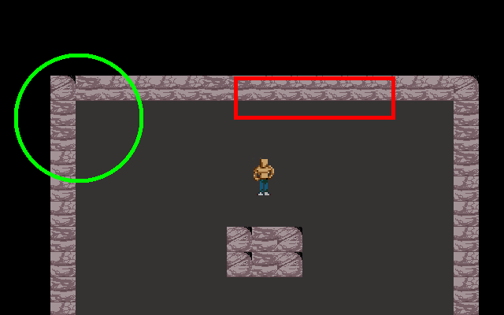
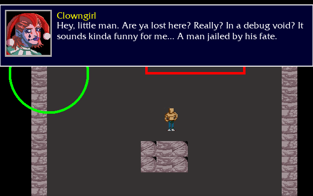
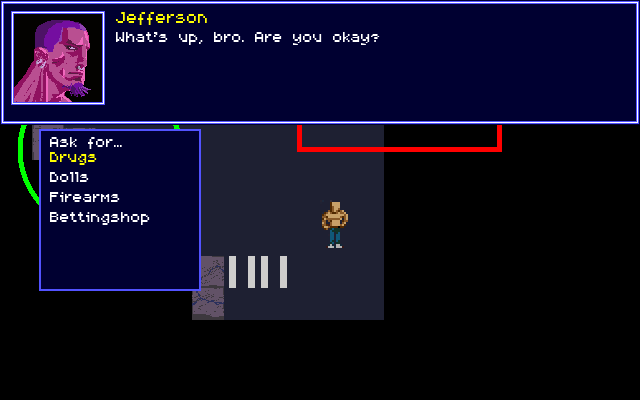
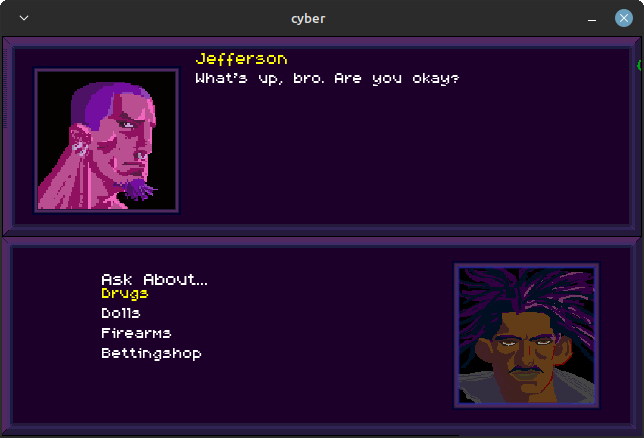

# CyberSP Project

Welcome to my private repository. Here you can read all the code of my first *C* languague game that I'm working on patiently. The library I'm deeply using is *Allegro 5* (the lastest version of a very old library from the MS-DOS age) and *LibTMX* for mapping.

The **CyberSP Project** initially was thought to be an *pseudoisometric computer game*, however, after I got a few headache with mathematic (which I'm a tremendously bad), it ended up becoming a *top-down computer game*. Whatever the point-to-view, this project follows some of my biggest personal inspirations (The Elders Scrolls III & IV, Diablo, Shadowrun (SNES)... and so on). It means a few mechanics or game design choices; and it doesn't I'll mix up everything from them and build a Frankstein, though.

# Development Photos

